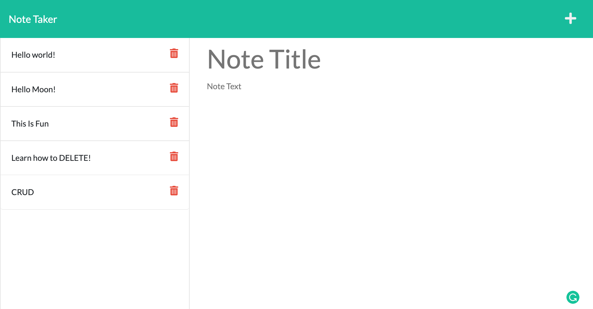
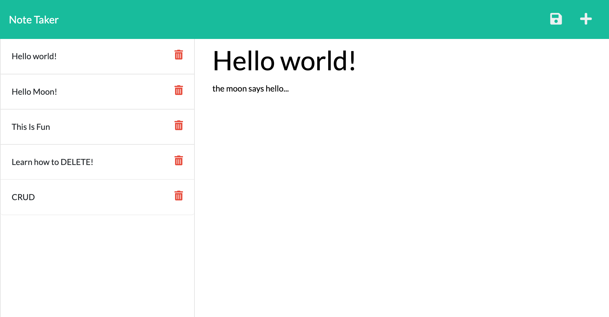

# **Note Taker**
***

## Table of Contents
1. [Description](#description)  
2. [Links](#links)  
3. [Visuals](#visuals)  
***

## Description
**Note Taker** is an application that can be used to write and save notes. This application uses an Express.js back end and will save and retrieve note data from a JSON file. When Note Taker is opened the user is presented with a landing page with a link to a notes page
When they click on the link to the notes page then they are presented with a page with existing notes listed in the left-hand column, plus empty fields to enter a new note title and the note’s text in the right-hand column. When they enter a new note title and the note’s text then a Save icon appears in the navigation at the top of the page. When they click on the Save icon then the new note they have entered is saved and appears in the left-hand column with the other existing notes. When they click on an existing note in the list in the left-hand column then that note appears in the right-hand column. When they click on the Write icon in the navigation at the top of the page then they are presented with empty fields to enter a new note title and the note’s text in the right-hand column.

***

## Links
[Link to Note Taker](https://still-refuge-91323.herokuapp.com/)

[Link to GitHub](https://github.com/mattholtmoore/note-taker-project)  
***

## Visuals

 

